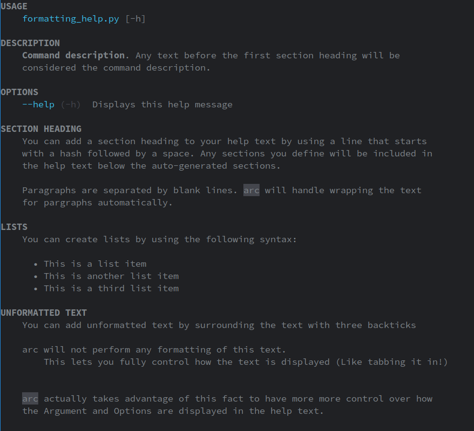

Every *arc* application / command comes with a builtin `--help` flag.

## Example
```py title="hello.py"
--8<-- "examples/hello.py"
```
```console
--8<-- "examples/outputs/hello_help"
```


## Parameter Documentation
Command parameters are documented using the `desc` argument of `Argument` / `Option` / `Flag`.

The following command:
```py title="arguments_documentation.py"
--8<-- "examples/arguments_documentation.py"
```
Will produce the following help output:
```console
--8<-- "examples/outputs/arguments_documentation"
```

## Formatting
*arc* supports a markdown-like syntax for formatting help output.


### Example
```py title="examples/formatting_help.py"
--8<-- "examples/formatting_help.py"
```



### Syntax
The following syntax is supported:

| Syntax                     | Description                                                                          |
| -------------------------- | ------------------------------------------------------------------------------------ |
| `**bold**`                 | Bolds Text                                                                           |
| `*italic*`                 | Italicizes Text                                                                      |
| `~~strikethrough~~`        | Strikethrough Text                                                                   |
| `__underline__`            | Underlines Text                                                                      |
| `` `code` ``               | Inline Code Block. Useful for when you want to indicate how to run another command   |
| `[www.example.com]`        | Marks text as a link. Colors it with `config.present.color.accent` and underlines it |
| `[[fg.RED]]red[[/fg.RED]]` | Colors Text. See [Colors](#colors) for more information                              |
| `---`                      | Inserts a horizontal rule                                                            |


### Colors
You are able to color text using the `[[fg.COLOR]]text[[/fg.COLOR]]` syntax. The following objects are available for use:

- `fg` - [Foreground Colors](../reference/present/ansi.md#arc.present.ansi.fg)
- `bg` - [Background Colors](../reference/present/ansi.md#arc.present.ansi.bg)
- `color` - [Configured Colors](./presentation/coloring.md#configured-arc-colors)
