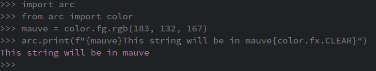
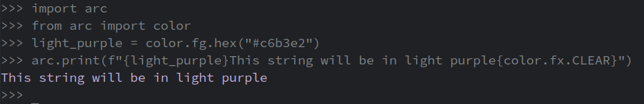
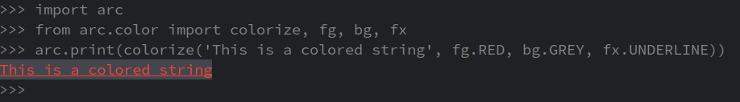

Spice up your script's output with some color! *arc* implements support for the basic ANSI-16 color scheme, and rgb / hex colors codes

The [reference contains a full breakdown of all the constants and methods](../../reference/present/ansi.md)

## Ansi Codes
ANSI escape codes are defined as constants on the `fg`, `bg` and `fx` classes
```py
import arc
from arc import color

@arc.command
def command():
    arc.print(f"{color.fg.RED}This will be in red!{color.fx.CLEAR}")

command()
```

## RGB
Create new colors using `#!python fg.rgb()` and `#!python bg.rgb()`
```py
import arc
from arc import color
mauve = color.fg.rgb(183, 132, 167)
arc.print(f"{mauve}This string will be in mauve{color.fx.CLEAR}")
```


## Hex
Create new colors using `#!python fg.hex()` and `#!python bg.hex()`
```py
import arc
from arc import color
light_purple = color.fg.hex("#c6b3e2")
arc.print(f"{light_purple}This string will be in light purple{color.fx.CLEAR}")
```


## `colorize()`
`#!python arc.color.colorize()` applies an arbitrary number of colors / effects to the provided string, and adds `fx.CLEAR` to the end of the string. It can make applying a bunch of different effects to a string a little cleaner than just appending them to the start of a string. Using this is essentially up to personal preference.
```py
import arc
from arc.color import colorize, fg, bg, fx
arc.print(colorize('This is a colored string', fg.RED, bg.GREY, fx.UNDERLINE))
# As opposed to:
arc.print(f"{fg.RED}{bg.GREY}{fx.UNDERLINE}This is a colored string{fx.CLEAR})
```



## Configured arc Colors
*arc* also colors some of it's own output using the colors defined in `#!python config.present.color`. You may configure these colors to your liking by setting them in your `#!python arc.configure()` call. The following colors are  configurable with the builtin in `ColorConfig` class:

```py

import arc

arc.configure(
    present=arc.PresentConfig(
        color=arc.ColorConfig(
            accent=arc.fg.GREEN,
            error=arc.fg.RED,
            highlight=arc.fg.WHITE,
        )
    )
)

```
