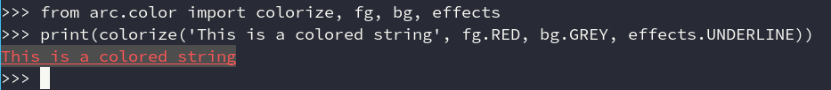

## Printing

When writing data to the screen in arc, it is recomended that you use: `#!python arc.print()`, although it is not required.


## Logging
*arc* has a logger setup that will change it's level based on the current enviroment.

```py
import arc

# Uncomment the below line for the log to
# print to the screen.
# arc.configure(enviroment="development")

@arc.command()
def command(ctx: Context):
    ctx.logger.debug('hello there!')

command()
```

The levels are:

- development: `DEBUG`
- production: `WARNING`

## Coloring
Spice up your script's output with some color! Implements both the basic ANSI-16 color scheme, and rgb

!!! note
    `#!python arc.print()` has the same signature as `#!python print()`, while
    also handling removing escape-codes when not writing to a TTY. Because of this,
    you should generally always use `#!python arc.print()` in favor of `#!python print()`


```py
import arc
from arc import color

@arc.command()
def command():
    arc.print(f"{color.fg.RED}This will be in red!{color.effects.CLEAR}")

command()
```

The [reference contains a full breakdown of all the constants and methods](../reference/color.md)

### `colorize()`
`#!python arc.color.colorize()` applies an arbitrary number of colors / effects to the provided string, and adds `effects.CLEAR` to the end of the string.
```py
from arc.color import colorize, fg, bg, effects
arc.print(colorize('This is a colored string', fg.RED, bg.GREY, effects.UNDERLINE))
```



